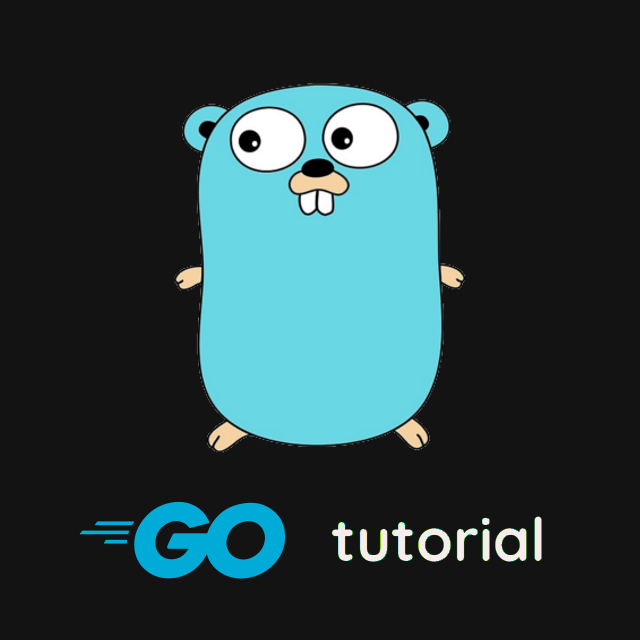

## go modules
## membuat module

````go
package go_say_hello

func SayHello() string {
        return 'hello'
}

````


## menambah dependency
````
go get nama dependency
````

## upgrade module
untuk mengup

