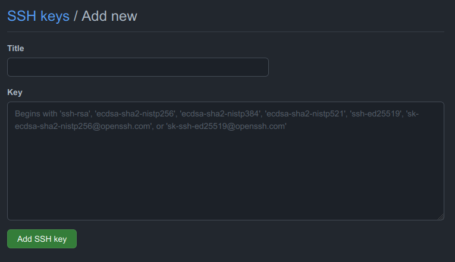

<br />

## Langkah 1 - Generate SSH Key baru

Buat SSH Key yang baru setiap kita ingin menambahkan akun github di terminal. Caranya adalah dengan mengetik perintah dibawah ini:
````
ssh-keygen -t rsa -C "alamat-email-anda"
````
Setelah menjalankan perintah kita akan diminta untuk membuat `id_rsa`. Hati-hati dibagian ini jangan sampai kita menimpa `id_rsa` sebelumnya. 
Oleh karena itu kita bisa menambahkan namanya untuk membedakan. Sebagai contoh kita bisa memberi nama `id_rsa_second` atau `id_rsa_work`, dsb. 
Di pc saya file tersebut akan tersimpan menjadi  `~/.ssh/id_rsa_second`.

## Langkah 2 - Masukan SSH Key ke Github
Setelah itu login di github.com ke akun github yang akan ditambahkan di terminal. Setelah itu klik ikon di kanan atas dan klik `Settings`. Cari dan klik `SSH and GPG keys`, kemudian tambahkan dengan mengklik tombol `New SSH key`. Akan muncul tampilan dibawah:  


<br />

Buka file  `~/.ssh/id_rsa_second.pub`, kemudian copy seluruh isi file tersebut ke input textarea `Key` diatas, jangan lupa untuk mengisi judul sesuai yang kita inginkan. Kemudian, karena kita menyimpan key dengan nama yang unik, kita perlu untuk memberitahu SSH tentang ini. Di terminal, ketik `ssh-add ~/.ssh/id_rsa_second`. Jika sukses, kita akan melihat respon `Identity Added.`

## Langkah 3 - Membuat File Konfigurasi

Setelah melakukan langkah-langkah diatas, kita perlu membuat konfigurasi untuk menentukan akun mana yang akan digunakan. Caranya adalah dengan membuat dan paste konfigurasi dibawah di file ini  `~/.ssh/config`

````
Host github.com
  HostName github.com
  User git
  IdentityFile ~/.ssh/id_rsa

Host github-second
  HostName github.com
  User git
  IdentityFile ~/.ssh/id_rsa_second
````
File diatas maksudnya, ketika kita akan melakukan cloning atau membuat repository dengan menggunakan domain `github.com` maka akun yang akan digunakan adalah akun utama yang ssh key nya terdapat di file `id_rsa.pub`, sedangkan jika menggunakan domain `github-second.com` maka akan menggunakan akun yang kedua. 
Untuk lebih jelasnya bisa dilihat di step ke 4. 

## Langkah 4 - Uji coba
Saatnya kita menguji apa yang telah kita lakukan. Buatlah sebuah folder beranama test, inisialasi git dan buat commit pertama

````
git init
git commit -am "first commit'
````
Login di akun yang kedua dan buat repository dengan nama "testing" dan kembali ke terminal untuk mem-push file yang telah kita commit sebelumnya ke repository di github. 

````
git remote add origin git@github-second:second_account/testing.git
git push origin master
````
Catatan: git@github.com diganti menjadi git@github-second karena kita akan menggunakan akun kedua kita dan `second_account` adalah akun kita, harap sesuaikan dengan akun Anda yang semestinya.

Buka repository GitHub yang telah dibuat sebelumnya! Kita akan mendapati commit yang kita push akan ada di repository kita. Selamat mencoba..

Sumber: https://gist.github.com/JoaquimLey/e6049a12c8fd2923611802384cd2fb4a
