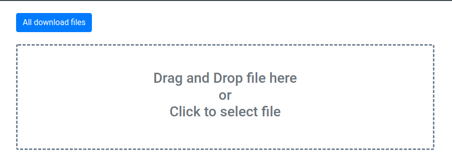

Pada postingan kali ini kita akan belajar untuk membuat aplikasi upload file menggunakan PHP. 
Di aplikasi ini kita bisa mengupload file dengan menglik tombol upload atau dengan drag and drop. 
Saat proses upload berlangsung akan ada progress bar untuk menunjukan progres file yang kita upload terkirim ke server. 
Tanpa berlama-lama, silahkan buat folder kemudian buatlah file-file di bawah ini: 

## Struktur File dan Folder Projek
`````
├── index.html
├── script.js
├── upload.php
└── uploads/
`````
<br />
<br />

## File HTML
Pada file html ini kita akan menambahkan `<input id="file"` sebagai input file untuk upload. 
Di sini input tersebut akan disembunyikan, sebagai gantinya fungsi upload akan ditrigger oleh `<div id="uploadfile"` ketika mengklik atau mendrag and drop. 
Ketika ada trigger tersebut, `<input id="file"` akan berisi file yang akan diupload.
Selengkapnya silahkan lihat kode dibawah ini.

**index.html**
`````html
<!DOCTYPE html>
<html lang="en">
<head>
  <meta charset="UTF-8">
  <title>Upload File Drag and Drop with Progresbar</title>
  <link rel="stylesheet" href="https://cdn.jsdelivr.net/npm/bootstrap@4.6.1/dist/css/bootstrap.min.css" integrity="sha384-zCbKRCUGaJDkqS1kPbPd7TveP5iyJE0EjAuZQTgFLD2ylzuqKfdKlfG/eSrtxUkn" crossorigin="anonymous">
  <style>
    .upload-area {
      border: 3px dashed slategray;
    }

    .upload-area:hover {
      cursor: pointer;
    }
  </style>
</head>
<body>
  <div class="container mt-4">
    <div class="row">
      <div class="col">
        <a class="btn btn-primary" href="uploads/">All download files</a>
      </div>
    </div>
    <input id="file" type="file" name="file" style="display: none;">
    <div id="uploadfile" class="mt-4 p-5 rounded upload-area w-75">
      <h3 id="text_info_upload" class="text-center text-muted">Drag and Drop file here<br />or<br/>Click to select file</h3>
      <div class="progress" style="display: none;">
        <div class="progress-bar progress-bar-striped" role="progressbar" style="width: 0%"></div>
      </div>
    </div>
  </div>
  <script src="https://ajax.googleapis.com/ajax/libs/jquery/3.6.0/jquery.min.js"></script>
  <script src="https://cdn.jsdelivr.net/npm/bootstrap@4.6.1/dist/js/bootstrap.bundle.min.js" integrity="sha384-fQybjgWLrvvRgtW6bFlB7jaZrFsaBXjsOMm/tB9LTS58ONXgqbR9W8oWht/amnpF" crossorigin="anonymous"></script>
  <script src="script.js" type="text/javascript"></script>
</body>
</html>
`````
Tampilan dari kode di atas kurang lebih akan menjadi seperti ini: 



## File Javascript
Kode javascript di bawah merupakan rangkaian kode untuk menghandle drag and drop atau klik update `<div class="upload-area"`.
Saat file telah dipilih kemudian aplikasi akan mengirimkan ke server dalam bentuk `FormData`, setelah itu data dikirim ke server.
Pada saat proses mengiriman data, `<div class="progress-bar"` akan berubah panjangnya sesuai dengan presentasi upload file nya. 

**script.js**
`````javascript
function drop(e) {
  e.stopPropagation()
  e.preventDefault()

  $('#text_info_upload').text('Drop')
}

$(function() {
  $('html').on('dragover', function(e) {
    e.preventDefault()
    e.stopPropagation()
    $('#text_info_upload').text('Drag here')
  })

  // dragenter or dragover
  $('.upload-area')
    .on('dragenter', (e) => drop(e))
    .on('dragover', (e) => drop(e))

  // drop 
  $('.upload-area').on('drop', function(e) {
    e.stopPropagation()
    e.preventDefault()
    var file = e.originalEvent.dataTransfer.files

    var formData = new FormData()
    formData.append('file', file[0])

    uploadData(formData)
  })

  $('#uploadfile').click(function() {
    $('#file').click()
  })

  $('#file').change(function() {
    $('#text_info_upload').text('Please wait')
    var fd = new FormData()

    var files = $('#file')[0].files[0]

    fd.append('file', files)

    uploadData(fd)
  })
})

function uploadData(formData) {
  $.ajax({
    xhr: function() {
      var xhr = new window.XMLHttpRequest()
      xhr.upload.addEventListener('progress', function(evt) {
        if (evt.lengthComputable) {
          progress = Math.round((evt.loaded / evt.total) * 100)
          $('.progress-bar').width(progress + '%')
        }
      })

      return xhr
    },
    url: 'upload.php',
    type: 'POST',
    data: formData,
    contentType: false,
    processData: false,
    dataType: 'json',
    beforeSend: function() {
      $('#text_info_upload').text('Uploading')
      $('.progress').show()
      $('.progress-bar').width('0%')
    },
    success: function(response) {
      $('#text_info_upload').text('Upload is successfully')

      // wait 5 seconds
      var result = new Promise(function(resolve) {
        setTimeout(function() {
          resolve('success')
        }, 5000)
      })

      result.then(function() {
          $('#text_info_upload').html('Drag and Drop file here<br/>or<br/>Click to select file')
          $('.progress').hide()
      })
    }
  })
}
`````
## File PHP
File `upload.php` bertugas untuk mengupload file ke folder `uploads/`. Setelah sukses diupload maka file php ini akan mengembalikan output dalam bentuk JSON, yang berisi nama file, ukuran, dan url  file yang diupload. Tanpa berlama-lama berikut kode selengkapnya: 

**upload.php**

`````c
<?php

$fileName = $_FILES['file']['name'];
$fileSize =  $_FILES['file']['size'];
$location = "uploads/" . $fileName;
$returnArr = array();

if (move_uploaded_file($_FILES['file']['tmp_name'], $location)) {
    $src = "default.png";

    if (is_array(getimagesize($location))) {
        $src = $location;
    }

    $returnArray = array(
        'name' => $fileName,
        'size'=> $fileSize,
        'src' => $src
    );
}

echo json_encode($returnArray);
`````

Source code: https://github.com/khoufstudio/upload-file-drag-n-drop-with-progressbar-jquery-php

Sumber: 
- https://makitweb.com/drag-and-drop-file-upload-with-jquery-and-ajax/
- https://www.laravelcode.com/post/how-to-files-upload-with-progress-bar-help-of-jquery-ajax-php

